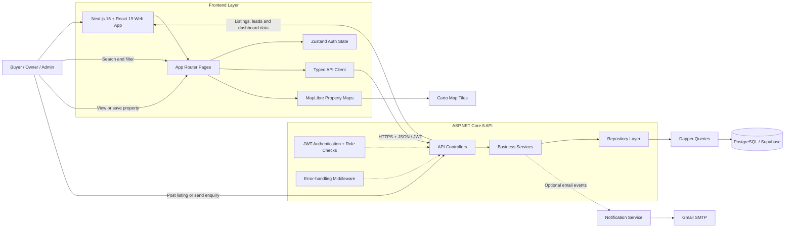

<div align="center">

# 🏠 ApnaNest

**Find the place where life happens.**

A full-stack real estate platform for India — buy, sell, or rent properties with verified listings, zero brokerage options, and direct owner contact.

[](https://nextjs.org/)
[](https://dotnet.microsoft.com/)
[](https://supabase.com/)

</div>

---

## ✨ Features

| Category | Details |
|---|---|
| 🔍 **Property Search** | Filter by type, price, BHK, furnishing, locality with live map view |
| 🗺️ **Interactive Maps** | MapLibre GL + Carto Voyager tiles — no API key required |
| 📝 **Post Property** | Multi-step wizard with image uploads, amenities, and RERA info |
| 🔐 **Authentication** | JWT-based login/signup with buyer & owner roles |
| 📊 **Dashboard** | Manage listings, view leads, saved properties, and account settings |
| 🏗️ **New Projects** | Browse builder projects with RERA verification |
| 🧮 **Tools** | EMI calculator, rent receipt generator, property valuation, affordability checker |
| 📰 **News & Insights** | Real estate articles and market trends |
| 👥 **Find Agents** | Verified real estate agents directory |
| 📱 **Responsive** | Mobile-first design with bottom navigation bar |

---

## 🏗️ Architecture & Application Flow

ApnaNest follows a layered full-stack architecture. The Next.js application handles the user experience, the ASP.NET Core API owns authentication and business rules, and Dapper repositories provide parameterized access to PostgreSQL.



### Typical User Journey

1. A visitor searches by city, locality, listing type, price, or property attributes.
2. The frontend requests matching listings from the API and displays results with map context.
3. After authentication, buyers can save properties and submit enquiries.
4. Owners can publish listings and manage owner-scoped leads from the dashboard.
5. Administrators can review platform data through role-protected endpoints.

---

## 🛠️ Tech Stack

| Layer | Technology |
|---|---|
| **Frontend** | Next.js 16 (App Router), React 19, TypeScript, Tailwind CSS 4 |
| **UI Components** | Radix UI, Lucide Icons, Framer Motion |
| **State Management** | Zustand |
| **Maps** | MapLibre GL + react-map-gl (Carto Voyager free tiles) |
| **Backend** | .NET 8, ASP.NET Core Web API |
| **ORM / Data** | Dapper (micro-ORM) |
| **Database** | Supabase PostgreSQL |
| **Auth** | JWT Bearer tokens (custom implementation) |
| **API Docs** | Swagger / OpenAPI |

---

## 📋 Prerequisites

Before you begin, ensure you have the following installed:

| Tool | Version | Download |
|---|---|---|
| **Node.js** | v20+ | [nodejs.org](https://nodejs.org/) |
| **.NET SDK** | 8.0+ | [dotnet.microsoft.com](https://dotnet.microsoft.com/download/dotnet/8.0) |
| **Git** | Latest | [git-scm.com](https://git-scm.com/) |
| **Supabase Account** | Free tier | [supabase.com](https://supabase.com/) |

### Optional Service Accounts

| Service | When It Is Needed |
|---|---|
| **Gmail App Password** | Only when running the optional notification service |
| **Vercel** | Only when deploying the Next.js frontend |
| **Render** | Only when deploying the ASP.NET Core backend |

> Source-code review and local development do not require Vercel or Render accounts. Any PostgreSQL-compatible database can be used instead of Supabase.

---

## 🚀 Getting Started

### 1. Clone the Repository

```bash
git clone https://github.com/prakashinfotech/apna-nest.git
cd apna-nest
```

### 2. Set Up the Database (Supabase)

1. Create a new project at [supabase.com](https://supabase.com/)
2. Go to **SQL Editor** in your Supabase dashboard
3. Copy the contents of [`seeds/sql/apnanest_seed.sql`](seeds/sql/apnanest_seed.sql) and run it
4. This creates all required tables and inserts essential static data (cities, amenities, sample properties, etc.)
5. Go to **Settings → Database → Connection string** and copy the URI

### 3. Set Up the Backend (.NET)

```bash
cd backend/src/ApnaNest.API
```

Update the connection string in `appsettings.json` (for local dev only — **never commit real credentials**):

```json
{
  "ConnectionStrings": {
    "DefaultConnection": "Host=YOUR_HOST;Port=6543;Database=postgres;Username=YOUR_USER;Password=YOUR_PASSWORD;Ssl Mode=Require;Trust Server Certificate=true;"
  },
  "JwtSettings": {
    "Secret": "your_64_char_secret_key_here_make_it_long_and_random_enough"
  }
}
```

> 💡 **Tip:** Use [.NET User Secrets](https://learn.microsoft.com/en-us/aspnet/core/security/app-secrets) for local development:
> ```bash
> dotnet user-secrets set "ConnectionStrings:DefaultConnection" "Host=..."
> dotnet user-secrets set "JwtSettings:Secret" "your_secret_key"
> ```

Run the backend:

```bash
dotnet restore
dotnet run
```

The API will start at `http://localhost:5000`. Swagger docs are available at `http://localhost:5000/swagger`.

### 4. Set Up the Frontend (Next.js)

```bash
cd frontend
```

Create the environment file:

```bash
cp .env.example .env.local
```

The default `.env.local` contains:
```
NEXT_PUBLIC_API_URL=http://localhost:5000/api
```

Install dependencies and start:

```bash
npm install --legacy-peer-deps
npm run dev
```

The frontend will start at `http://localhost:3000`.

> ⚠️ **Note:** `--legacy-peer-deps` is required due to some peer dependency conflicts between React 19 and older Radix UI packages.

---

## 📁 Project Structure

```
apnanest/
├── frontend/                    # Next.js 16 App
│   ├── app/                     # App Router pages
│   │   ├── page.tsx             # Home page
│   │   ├── search/              # Property search + map view
│   │   ├── property/[id]/       # Property detail page
│   │   ├── post-property/       # Post property wizard
│   │   ├── dashboard/           # User dashboard (protected)
│   │   ├── tools/               # EMI, rent receipt, valuation
│   │   ├── news/                # Articles & insights
│   │   ├── projects/            # New builder projects
│   │   ├── agents/              # Agent directory
│   │   ├── localities/          # Locality guides
│   │   └── about|contact/       # Static pages
│   ├── components/              # Reusable React components
│   │   ├── auth/                # Auth modal, URL handler
│   │   ├── home/                # Homepage sections
│   │   ├── search/              # Search results, map, filters
│   │   ├── property/            # Property detail sections
│   │   ├── post-property/       # Multi-step form wizard
│   │   └── ui/                  # shadcn/ui base components
│   ├── lib/                     # Utilities, types, stores
│   │   ├── api.ts               # API client
│   │   ├── stores/auth-store.ts # Zustand auth state
│   │   ├── constants.ts         # Static data (cities, etc.)
│   │   ├── types.ts             # TypeScript interfaces
│   │   └── utils.ts             # Helper functions
│   └── public/                  # Static assets
│
├── backend/                     # .NET 8 Web API
│   ├── src/
│   │   ├── ApnaNest.API/        # Controllers, middleware, config
│   │   ├── ApnaNest.Services/   # Business logic layer
│   │   └── ApnaNest.Data/       # Repositories, Dapper queries
│   └── schema.sql               # Database schema (run in Supabase)
│
├── docs/                        # Documentation
│   └── PRD.md                   # Product requirements document
│
└── seeds/                       # Seed data scripts
```

---

## 🔌 API Endpoints

The backend exposes these API groups (see full docs at `/swagger`):

| Method | Endpoint | Description |
|---|---|---|
| `POST` | `/api/auth/register` | Register new user |
| `POST` | `/api/auth/login` | Login with email + password |
| `GET` | `/api/properties` | List/search properties |
| `GET` | `/api/properties/{id}` | Get property details |
| `POST` | `/api/properties` | Create property (auth required) |
| `PUT` | `/api/properties/{id}` | Update property (auth required) |
| `POST` | `/api/leads` | Submit enquiry lead |
| `GET` | `/api/leads/my` | Get current owner's leads (auth required) |

---

## 🧪 Development

### Frontend Commands

```bash
npm run dev          # Start dev server
npm run build        # Production build
npm run lint         # ESLint
npm run typecheck    # TypeScript check
```

### Backend Commands

```bash
dotnet run           # Start API server
dotnet build         # Build project
dotnet test          # Run tests
```

---

## ☁️ Optional Deployment

This showcase repository has **no active GitHub Actions deployment workflow**, so normal pushes do not deploy the application or require cloud secrets.

For teams that want deployment later:

1. Create a Vercel project for `frontend/`.
2. Create a Render web service for the backend Dockerfile.
3. Configure the production database connection and JWT secret in the hosting platforms.
4. Add `RENDER_DEPLOY_HOOK` and `VERCEL_DEPLOY_HOOK` as GitHub Actions secrets.
5. Copy [`docs/deploy.example.yml`](docs/deploy.example.yml) into `.github/workflows/deploy.yml` and enable the desired trigger.

The example uses a manual `workflow_dispatch` trigger by default to prevent accidental deployments.

---

## 🤝 Contributing

1. Fork the repository
2. Create a feature branch (`git checkout -b feature/amazing-feature`)
3. Commit your changes (`git commit -m 'Add amazing feature'`)
4. Push to the branch (`git push origin feature/amazing-feature`)
5. Open a Pull Request

---

## 📄 Repository Use

This repository is maintained by Prakash Infotech as a project showcase. Add an approved `LICENSE` file before distributing or reusing the source under a public software license.

---

<div align="center">

**Built with ❤️ for the Indian real estate market**

</div>
